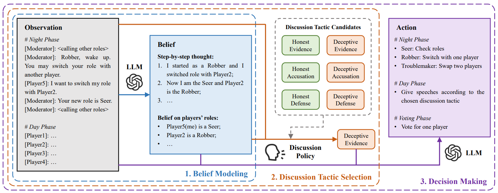
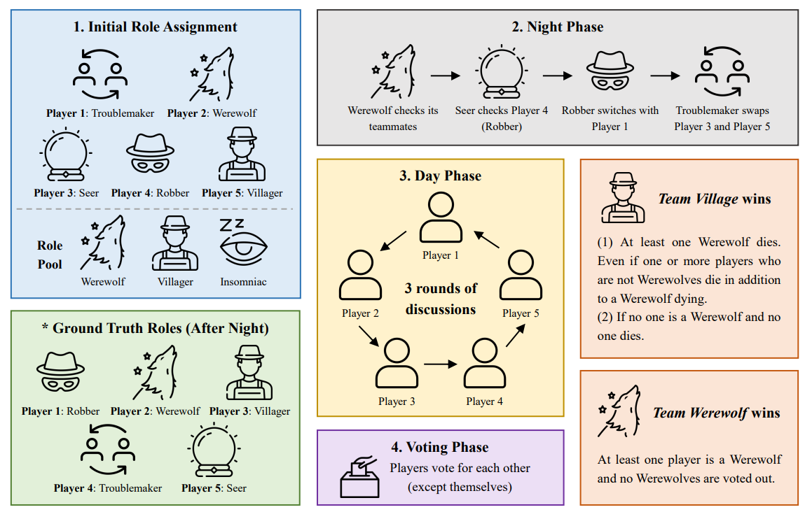

# [NeurIPS 2024] Learning to Discuss Strategically: A Case Study on *One Night Ultimate Werewolf*
This repo contains an implementation of the *One Night Ultimate Werewolf* game environment and the RL-instructed LLM-based agent framework proposed in the paper [**Learning to Discuss Strategically: A Case Study on *One Night Ultimate Werewolf***](https://nips.cc/virtual/2024/poster/96856) (accepted by NeurIPS 2024).

## RL-instructed LLM-based Agent Framework



Our RL-instructed LLM-based agent framework consists of three key components:

1. *Belief Modeling*: Form beliefs on players' roles based on the observation;
2. *Discussion Tactic Selection*: Utilize a discussion policy trained by RL to choose a discussion tactic from the candidates;
3. *Decision Making*: Take action based on the observation (also belief and discussion tactic, according to the game phase).

## Getting Start

### Step 1: Installation

Requirements:

- Python >= 3.9

For other dependencies, you can install with pip:
```bash
pip install -r requirements.txt
```

### Step 2: Setting LLM APIs

Currently, we implemented the access to ChatGPT and Gemini as the backends of agents. Before utilizing these LLMs, export your OpenAI and Gemini API key as environment variables:

```bash
export OPENAI_API_KEY="Your OpenAI API Key"
export GOOGLE_API_KEY="Your Gemini API Key"
```
or use `.env` file to set your LLM APIs in advance.

In defult, the ChatGPT model is **"gpt-4-1106-preview"** and the Gemini model is **"gemini-pro"**. If you want to change the default model, please refer to the **`DEFAULT_MODEL`** variable in corresponding backend class in `onuw/backends`.

## *One Night Ultimate Werewolf* (ONUW) Game Env

One Night Ultimate Werewolf (ONUW) is a variant of the social game Werewolf. Initially, roles are randomly dealt to players. Then three phases: **Night** (abilities performed in order), **Day** (open discussion), and **Voting** (suspicious player voted out) proceed sequentially. The winner is decided by the voting result.



The implementation of the standard game env is in `onuw/environments/werewolf.py`, where you can modify the game logic. And other envs are implemented for experiments.

If there are new roles, you can add them in `onuw/agents/roles`, following the class structure of roles that already implemented.

## Run Game

Now the game can only be run in local cmd/bash, here is the instruction:

```bash
python main.py --env <game environment name> --num_runs <number of runs of different settings> --num_repeats <number of repeating runs in one setting> --random --cli --save_path <save path for game logs>
```
The following options are only enabled when added:

- `random`: Randomly assign roles at the beginning
- `cli`: Launch cli (the interactive interface in the command line)

### About Human Participation
If one wants to participate in the game, please refer to the game configs in `configs`, and set `structure` in corresponding player's config to **"human"**.

> *P.S.* When setting `structure` to **"human"**, it will render the `backend` config of that player invalid. But the `backend` config **has to be retained** to ensure the game loads properly. And you can change the `backend_type` to **"human"** to keep consistency (though it has no effect).

## Citation
If you find our work or repositroy useful for your research, you can use the following BibTeX entry:
```bibtex
@article{
    jin2024learning,
    title={Learning to Discuss Strategically: A Case Study on One Night Ultimate Werewolf},
    author={Jin, Xuanfa and Wang, Ziyan and Du, Yali and Fang, Meng and Zhang, Haifeng and Wang, Jun},
    journal={arXiv preprint arXiv:2405.19946},
    year={2024}
}
```
